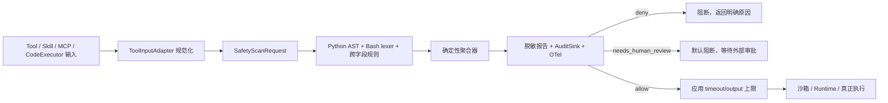

# Tool Script Safety Guard 实施计划

## 范围修订：仅维护计划，后续实现必须全量新增

本任务仅更新计划，不进行编码。后续获准实施时，只能在根目录新增 `tool/safety/`、`tests/tool_safety/`、`examples/tool_safety/`、`scripts/` 与 `docs/` 下的文件；不得修改 `trpc_agent_sdk/`、已有测试、示例、项目配置、Telemetry、Filter 或 CodeExecutor 的任何既有文件。文档中的框架直接接入改为未来集成点，本次范围仅提供独立 wrapper 示例。

## 1. 需求摘要

为 Python 与 Bash 执行建立一条可审计的前置安全门：输入脚本、argv、cwd、env 与 tool 元数据，经过可插拔规则扫描后输出 `allow`、`deny` 或 `needs_human_review`。`deny` 与未获批准的 `needs_human_review` 必须在任何文件、网络或进程副作用发生前终止；所有决策都必须产生脱敏报告、JSONL 审计事件和 OpenTelemetry 属性。

本次交付覆盖 Tool、MCP Tool、Skill 命令执行和 CodeExecutor。静态 Guard 是纵深防御的一层，不承诺替代容器、远端沙箱、操作系统权限、网络 egress、cgroup/ulimit 或运行时超时。

## 2. 第一性原理

### 2.1 要保护的资产

1. 主机与工作区完整性：系统目录、源码、配置和凭据不能被未授权读取、覆盖或删除。
2. 数据机密性：环境变量、API Key、token、密码、私钥不能流向日志、文件或非授权网络目标。
3. 执行环境完整性：脚本不能任意提权、拉起隐藏进程或安装依赖改变环境。
4. 服务可用性：脚本不能通过无限循环、fork、长 sleep、超量并发或巨量输出耗尽资源。
5. 可追责性：每次执行尝试都能回答“谁、用什么 tool、触发哪条规则、是否被阻断、扫描耗时多少”。

### 2.2 必须成立的安全不变量

1. **先判断，后副作用**：最终安全检查位于参数完成解析/回调修改之后、`_run_async_impl`、`run_program`、`start_program` 或 `execute_code` 之前。
2. **不确定不等于安全**：解析失败、动态构造目标、未知语言和无法解析的间接执行至少进入 `needs_human_review`，不能默认 `allow`。
3. **高危命中不可被普通白名单覆盖**：允许命令只能放行“直接执行该命令”的基础风险，不能覆盖危险参数、禁止路径、非白名单域名、shell 注入或敏感信息外传。
4. **安全系统本身不泄密**：报告、审计、日志与 span 不保存原始 env 值、完整脚本或未脱敏证据；只保存受限证据、哈希和低基数字段。
5. **决策可重现**：相同规范化请求、策略版本和规则集合必须得到相同 findings 与决策；时间戳、scan id 不参与决策。
6. **静态判断与运行时隔离分责**：Guard 负责预判和拦截；沙箱、网络策略和资源控制负责阻止静态分析无法看见的运行时行为。

### 2.3 可知与不可知

- 静态可知：字面量路径/URL/命令、Python AST 调用、Bash 运算符与重定向、明显 source-to-sink 数据流、显式超时和并发常量。
- 静态不可完全知：反射、动态 import、`eval`/解码后执行、运行时拼接、软链接、DNS rebinding、HTTP redirect、下载后二阶段 payload、原生扩展副作用。
- 推论：规则引擎必须同时拥有确定性 `deny` 规则和保守的 `needs_human_review` 规则；文档必须明确绕过面，并要求生产环境继续使用沙箱。

## 3. 仓库现状与接入依据

- `BaseTool.run_async` 已在 `_run_async_impl` 前运行 Tool Filter，天然适合前置检查：`trpc_agent_sdk/tools/_base_tool.py:156`、`trpc_agent_sdk/tools/_base_tool.py:183`、`trpc_agent_sdk/tools/_base_tool.py:185`。
- `BaseFilter` 在 `_before` 设置 `is_continue=False` 时不会调用真实 handler：`trpc_agent_sdk/filter/_base_filter.py:208`、`trpc_agent_sdk/filter/_base_filter.py:215`、`trpc_agent_sdk/filter/_base_filter.py:219`。
- Tool Filter 已有注册入口：`trpc_agent_sdk/filter/_registry.py:169`。
- `workspace_exec` 的 `command/cwd/env/timeout_sec/background` 在执行前都位于 args：`trpc_agent_sdk/skills/tools/_workspace_exec.py:144`，真实执行从 `trpc_agent_sdk/skills/tools/_workspace_exec.py:288` 开始。
- `skill_run` 与 `skill_exec` 已暴露 filters，并分别在 `run_program`/`start_program` 前持有完整输入：`trpc_agent_sdk/skills/tools/_skill_run.py:372`、`trpc_agent_sdk/skills/tools/_skill_run.py:640`、`trpc_agent_sdk/skills/tools/_skill_exec.py:314`、`trpc_agent_sdk/skills/tools/_skill_exec.py:400`。
- CodeExecutor 的统一边界是 `BaseCodeExecutor.execute_code`：`trpc_agent_sdk/code_executors/_base_code_executor.py:98`；各实现目前直接执行 block，例如 `UnsafeLocalCodeExecutor` 在 `trpc_agent_sdk/code_executors/local/_unsafe_local_code_executor.py:59`。
- 运行规格已有 timeout 与 CPU/内存/PID 字段，但并非所有 runtime 都强制消费这些限制：`trpc_agent_sdk/code_executors/_types.py:110`、`trpc_agent_sdk/code_executors/_types.py:125`。
- 工具 span 在执行前已创建：`trpc_agent_sdk/agents/core/_tools_processor.py:343`；现有 tracing 会写入原始 args：`trpc_agent_sdk/agents/core/_tools_processor.py:438`、`trpc_agent_sdk/telemetry/_trace.py:304`。安全方案必须同时修复这条二次泄漏路径。
- PyYAML、Pydantic 与 OpenTelemetry 已是项目依赖，不需要新增重型解析器：`pyproject.toml:26`、`pyproject.toml:35`、`pyproject.toml:51`。

## 4. 目标架构



### 4.1 核心模型

在 `trpc_agent_sdk/tools/safety/` 新增 Pydantic 模型：

- `SafetyScanRequest`：`language`、`script`、`argv`、`cwd`、`env`、`tool_metadata`、`requested_timeout_seconds`、`requested_output_bytes`。
- `ToolMetadata`：`name`、`kind`（tool/mcp/skill/code_executor）、`description`、可选 adapter id；不接收任意不可序列化对象。
- `SafetyFinding`：`category`、`risk_level`、`rule_id`、`evidence`、`location`、`recommendation`、`proposed_decision`。
- `SafetyReport`：顶层固定包含 `decision`、`risk_level`、`rule_id`、`evidence`、`recommendation`、`findings`、`scan_duration_ms`、`redacted`、`script_sha256`、`policy_version`、`policy_sha256`。
- `SafetyAuditEvent`：至少包含 `tool_name`、`decision`、`risk_level`、主 `rule_id` 与全部 `rule_ids`、`elapsed_ms`、`redacted`、`execution_blocked`、`scan_id`、`timestamp`、策略指纹。

`allow` 报告使用稳定的 `SAFE000` 作为顶层 rule id，并以“未命中风险规则”作为 evidence，确保所有报告都满足验收字段要求。

### 4.2 可插拔规则接口

定义 `SafetyRule` 协议/ABC：稳定 `rule_id`、支持语言集合和纯函数式 `scan(context) -> list[SafetyFinding]`。Guard 构造时校验 rule id 唯一，默认规则可与业务自定义规则组合；规则不得执行被扫描脚本、发网络请求或读取目标凭据文件。

Python 使用 `ast.parse`、import alias 表、有限常量折叠与轻量 taint 传播；Bash 使用标准库 `shlex` 的 operator-preserving 模式并补充引号、重定向、管道、命令替换和后台符号识别。语法无法可靠解释时产出 `PARSE001`，而不是回退为安全。

### 4.3 决策聚合

优先级固定为 `deny > needs_human_review > allow`；同级按 risk level（critical > high > medium > low > info）、rule id、源码位置稳定排序。任何 critical/high 且规则动作是 deny 的 finding 立即决定 deny；解析不确定、动态目标和未知间接执行进入人工复核；没有风险 finding 才允许。

## 5. 策略文件

新增 `examples/tool_safety/tool_safety_policy.yaml`，由严格 Pydantic 模型加载，未知字段报错，配置错误在启动/CLI 阶段失败，不静默使用宽松默认值。核心字段：

```yaml
version: "1"
unknown_behavior: needs_human_review
allowed_domains:
  - api.example.com
  - "*.trusted.example.com"
allowed_commands: [python, python3, git, pytest]
denied_commands: [sudo, su, doas]
denied_paths:
  - "~/.ssh/**"
  - "**/.env"
  - "/etc/**"
  - "/root/**"
limits:
  max_timeout_seconds: 60
  max_output_bytes: 1048576
  max_file_write_bytes: 10485760
  max_sleep_seconds: 30
  max_concurrency: 16
  max_processes: 8
sensitive_env_key_patterns: ["*KEY*", "*TOKEN*", "*PASSWORD*", "*SECRET*"]
tool_adapters:
  workspace_exec: {language: bash, script_arg: command, cwd_arg: cwd, env_arg: env, timeout_arg: timeout_sec}
  skill_run: {language: bash, script_arg: command, cwd_arg: cwd, env_arg: env, timeout_arg: timeout}
  skill_exec: {language: bash, script_arg: command, cwd_arg: cwd, env_arg: env, timeout_arg: timeout}
rule_overrides: {}
audit:
  enabled: true
  required: true
  path: tool_safety_audit.jsonl
```

域名只允许精确匹配或显式 `*.` 子域模式，禁止用裸 `endswith`；`allowed_commands` 仅允许无 shell 运算符、`shell=False` 的直接命令，其他类别规则仍可否决。策略在 Guard 构造时加载；修改文件后重建 Guard/重启进程即可生效，无需改代码。

## 6. 默认规则目录

| 类别 | 主要 rule id | 判定原则 |
|---|---|---|
| 危险文件操作 | `FILE001_RECURSIVE_DELETE`、`FILE002_DENIED_WRITE`、`FILE003_CREDENTIAL_READ`、`FILE004_DOTENV_READ` | 递归删除、系统/禁止路径写入、`.ssh`/凭据/`.env` 读取为 deny；动态路径至少 review |
| 网络外连 | `NET001_DOMAIN_NOT_ALLOWED`、`NET002_DYNAMIC_TARGET` | curl/wget/requests/aiohttp/socket 的确定非白名单目标 deny；运行时拼接目标 review |
| 进程/系统命令 | `PROC001_PROCESS_EXEC`、`PROC002_SHELL_INJECTION`、`PROC003_SHELL_OPERATOR`、`PROC004_PRIVILEGE` | 允许命令的直接 argv 可 allow；`shell=True` 动态拼接、eval、提权 deny；未知 subprocess、管道/后台 review |
| 依赖安装 | `DEP001_ENV_MUTATION` | pip/npm/apt/yum/apk/brew 等 install 命令默认 deny，可由 rule override 调整为 review |
| 资源滥用 | `RES001_UNBOUNDED_LOOP`、`RES002_FORK_BOMB`、`RES003_LONG_SLEEP`、`RES004_CONCURRENCY`、`RES005_LARGE_WRITE` | fork bomb 与无退出无限循环 deny；超过策略阈值的 sleep/并发/写入按确定性 deny 或 review |
| 敏感信息泄漏 | `SECRET001_LOG_SINK`、`SECRET002_FILE_SINK`、`SECRET003_NETWORK_SINK` | 对 env/凭据/私钥 source 到 print/log/file/network sink 做有限 taint；确定链路 deny，模糊链路 review |
| 分析不确定性 | `PARSE001_UNCERTAIN`、`OBF001_DYNAMIC_EXEC` | 语法错误、未知语言、解码后执行、反射/动态 import 至少 review |

证据最多保留策略规定的字符数；先识别并替换私钥块、Bearer/token、常见 key 格式和 env 值，再写 report/audit。环境变量只记录 key，不记录 value。

## 7. 执行链路接入

### 7.1 Tool / Skill / MCP Filter

实现 `ToolScriptSafetyFilter(BaseFilter)`：从当前 tool 与 args 通过 `ToolInputAdapter` 构造请求，在 `_before` 扫描并先写审计。`deny` 或未批准的 `needs_human_review` 设置结构化 `rsp.rsp` 与 `is_continue=False`；`allow` 才调用下游 handler。

为消除“后续 callback 修改已扫描 args”的 TOCTOU，给 Filter 增加默认关闭、向后兼容的 terminal phase 标记；`FilterRunner` 按 `普通 filters -> ToolCallbackFilter -> terminal filters -> handler` 排序。安全 Filter 使用 terminal phase，并新增顺序测试。若不接受该小型核心改动，备选方案必须在每个实际执行 Tool 内部调用 `guard.enforce`，但不能只依赖一个可能被后续 Filter 绕过的外层扫描。

内置 adapter 覆盖 `workspace_exec`、`skill_run`、`skill_exec`；MCP 和自定义 Tool 通过策略声明字段映射。被显式标记为 execution-capable 但无法提取脚本的 Tool 返回 `needs_human_review`，不默认放行。

### 7.2 CodeExecutor wrapper

实现 `SafetyCheckedCodeExecutor(BaseCodeExecutor)`，包装任意现有 executor。它逐个扫描 `CodeExecutionInput.code_blocks`，汇总为一次执行决策，并在调用 delegate 的 `execute_code` 前阻断。deny/review 返回框架可消费、已脱敏的失败 `CodeExecutionResult`，不调用 delegate；allow 才委托执行。

wrapper 对 requested timeout 应用策略上限，并限制返回给 Agent 的输出字节数。该输出上限防止响应/观测面继续放大，但不宣称能限制 subprocess 内部缓冲；真实内存、CPU、PID、磁盘和网络上限仍由 Container/Cube/cgroup/egress policy 承担。

### 7.3 人工复核

默认行为是“review 即暂停/阻断”，绝不自动执行。Filter 返回 `status=needs_human_review`、`scan_id` 和脱敏 findings；文档给出与现有 `LongRunningFunctionTool`/`LongRunningEvent` 的组合示例。审批结果作为外部控制面输入，不由模型自行生成 token 绕过。

## 8. 审计、监控与 tracing

1. `AuditSink` 协议允许 JSONL、logging 或业务自定义 sink；默认 `JsonlAuditSink` 在执行前追加一行。`audit.required=true` 时写审计失败即 fail closed，并将错误写普通 logger。
2. 当前 span 写入低基数属性：`tool.safety.decision`、`tool.safety.risk_level`、`tool.safety.rule_id`、`tool.safety.blocked`、`tool.safety.redacted`、`tool.safety.scan_duration_ms`、`tool.safety.policy_version`。
3. 新增 counter `tool.safety.scan.count` 与 histogram `tool.safety.scan.duration`；metric 标签不包含 evidence、脚本哈希或 env 值。
4. 增加 task-local/contextvar 的 trace args override。安全 Filter 写入脱敏后的 args，`_tools_processor.py` 在 success/error 路径调用 `trace_tool_call` 时消费并在 finally 清理，避免现有 `trace_tool_call` 把原始 command/env 再次写进 span。必须测试并行 tool call 不串数据。

## 9. 文件级实施步骤

1. **定义契约与严格策略模型**：新增 `trpc_agent_sdk/tools/safety/_models.py`、`_policy.py`、`_exceptions.py` 和公开导出；加入枚举、schema 校验、策略哈希与确定性序列化。
2. **实现规范化与脱敏**：新增 `_adapters.py`、`_normalization.py`、`_redaction.py`；统一语言别名、cwd/`~`/环境变量路径、URL host、argv 和证据位置；保证不读取目标文件。
3. **实现规则引擎**：新增 `rules/_base.py`、`_python.py`、`_bash.py`、`_cross_field.py` 与 `_guard.py`；预编译 regex，AST/lexer 单次遍历，规则结果稳定排序。
4. **实现决策与策略覆盖**：在 `_guard.py` 实现三态聚合、允许命令/域名/禁止路径与阈值；解析失败和未知输入走 review；为 allow 生成 `SAFE000` 摘要。
5. **实现审计与 Telemetry**：新增 `_audit.py`、`_telemetry.py`；在 `trpc_agent_sdk/telemetry/` 增加安全 args override，并修改 `trpc_agent_sdk/agents/core/_tools_processor.py` 的两条 trace 路径，确保 raw args 不泄漏。
6. **接入执行链**：新增 `_filter.py` 与 `_code_executor.py`；在 `trpc_agent_sdk/filter/_base_filter.py`、`_filter_runner.py` 增加 terminal phase；从 `trpc_agent_sdk/tools/safety/__init__.py` 与 `trpc_agent_sdk/tools/__init__.py` 导出。
7. **提供 CLI 和示例资产**：新增 `scripts/tool_safety_check.py`，支持单文件与 manifest 批量扫描、JSON stdout/文件输出、JSONL audit；退出码约定 `0=allow`、`2=review`、`3=deny`、`4=输入/策略错误`。新增 `examples/tool_safety/` 下策略、样本 manifest、报告和审计样例；报告/审计样例由 CLI 生成而非手写。
8. **补齐单元、集成、性能测试**：新增 `tests/tools/safety/`；测试规则、策略热替换（重建 Guard）、聚合、脱敏、Filter 短路、CodeExecutor delegate 未调用、terminal 顺序、审计 fail-closed、OTel 属性、并发 context 隔离、CLI schema 与性能。
9. **编写双语设计文档**：新增 `docs/mkdocs/zh/tool_safety.md`、`docs/mkdocs/en/tool_safety.md` 并更新 `mkdocs.yml`；说明 Tool/Skill/MCP adapter、Filter、Telemetry、CodeExecutor、沙箱各自职责，误报/漏报/绕过面与自定义规则方式。

## 10. 公开样本与预期结果

在 `examples/tool_safety/samples/manifest.yaml` 提供至少以下 14 个可由 CLI 独立和批量扫描的样本：

| 样本 | 预期决策 | 主规则 |
|---|---|---|
| `01_safe_python.py` | allow | `SAFE000` |
| `02_safe_bash.sh` | allow | `SAFE000` |
| `03_dangerous_delete.py` | deny | `FILE001_RECURSIVE_DELETE` |
| `04_read_ssh_key.py` | deny | `FILE003_CREDENTIAL_READ` |
| `05_non_whitelist_network.py` | deny | `NET001_DOMAIN_NOT_ALLOWED` |
| `06_whitelist_network.py` | allow | `SAFE000` |
| `07_allowed_subprocess.py` | allow | `SAFE000` 或低风险允许命令 finding |
| `08_shell_injection.py` | deny | `PROC002_SHELL_INJECTION` |
| `09_dependency_install.sh` | deny | `DEP001_ENV_MUTATION` |
| `10_infinite_loop.py` | deny | `RES001_UNBOUNDED_LOOP` |
| `11_sensitive_output.py` | deny | `SECRET001_LOG_SINK` |
| `12_bash_pipeline.sh` | needs_human_review | `PROC003_SHELL_OPERATOR` |
| `13_read_dotenv.sh` | deny | `FILE004_DOTENV_READ` |
| `14_dynamic_command_review.py` | needs_human_review | `PARSE001_UNCERTAIN`/`PROC001_PROCESS_EXEC` |

另用参数化单测覆盖 requests/aiohttp/socket/curl/wget、Python/Bash 两种删除与凭据读取、fork bomb、长 sleep、大量并发和超大写入，避免只为 14 个固定文本调规则。

## 11. 可测试验收标准

1. manifest 中每个样本均能通过 API 和 CLI 扫描，输出通过 `SafetyReport` schema 校验，且决策与主规则符合表格。
2. 将 manifest 标注为 `safe/high_risk/review`：高危样本 `decision=deny` 比例不低于 90%，安全样本 `decision!=allow` 比例不高于 10%；测试直接计算并断言比例。
3. 危险删除、凭据读取、非白名单外连分别用 Python/Bash/库变体参数化，三组检出率均断言 100%。
4. 生成 500 行脚本，危险调用放在最后一行；预热后用 `time.perf_counter()` 扫描多次，单次最大耗时 `<1.0s`。性能测试不包含真实执行和网络/DNS。
5. 对 allow/deny/review 三类报告分别断言顶层 `decision/risk_level/rule_id/evidence/recommendation` 非空。
6. 临时修改策略中的 domain、command、path 后只重建 Guard，不改规则代码，断言决策随配置变化。
7. 用 spy handler/fake CodeExecutor 断言 deny/review 时调用次数为 0、allow 时为 1，并断言每次执行尝试恰好写一条审计事件。
8. OTel in-memory exporter 断言安全属性存在；脚本、API Key 与 env value 不出现在 span、audit、普通日志和阻断响应中。
9. `max_timeout_seconds` 在 wrapper/adapter 生效，返回 Agent 的输出不超过 `max_output_bytes`；测试同时注明这不是子进程内存硬限制。
10. 运行项目格式化、flake8/类型相关检查和 `pytest tests/tools/safety tests/filter tests/tools/test_base_tool.py tests/skills/tools`，确认 terminal filter 改动未破坏既有顺序语义。

## 12. 风险与缓解

- **规则绕过**：动态执行、混淆、软链接、下载后二阶段 payload 无法完全静态解析。缓解：不确定进入 review；生产必须使用无特权沙箱、只读挂载、网络白名单和资源上限。
- **误报**：服务型 `while True`、合法 pipeline、依赖安装可能有业务正当性。缓解：稳定 rule id、精确 evidence、逐规则策略 override；高危白名单不跨类别覆盖。
- **漏报**：轻量 taint 不是完整跨过程数据流。缓解：规则 corpus 加变体/对抗测试，允许注入自定义规则，后续可替换更强分析器而不改报告协议。
- **Filter 顺序/TOCTOU**：后置 callback 可能修改 args。缓解：terminal phase 或最后一公里 `guard.enforce`，并用 mutating callback 集成测试证明扫描看到最终参数。
- **观测泄密**：现有 trace 会记录 raw args。缓解：context-local sanitized override，success/error/并发路径全部测试；安全属性不携带高基数证据。
- **审计可用性**：磁盘满或 sink 故障会影响执行。缓解：`audit.required` 明确控制 fail-closed；生产建议用异步远端 sink + 本地有界缓冲，但不得以“成功形状”吞掉错误。
- **资源限制被高估**：截断返回值不能阻止进程产生巨量输出。缓解：文档区分 response cap 与 runtime hard limit；Container/Cube/cgroup/egress 是生产必选层。

## 13. 完成定义

只有在代码、策略、14 个公开样本、生成式 report/audit 示例、双语文档和上述测试全部通过后才视为完成。交付说明必须明确：Safety Guard 提供“执行前的静态策略门与可观测证据”，沙箱提供“执行时的强制隔离”；两者互补，任何一方都不能替代另一方。
